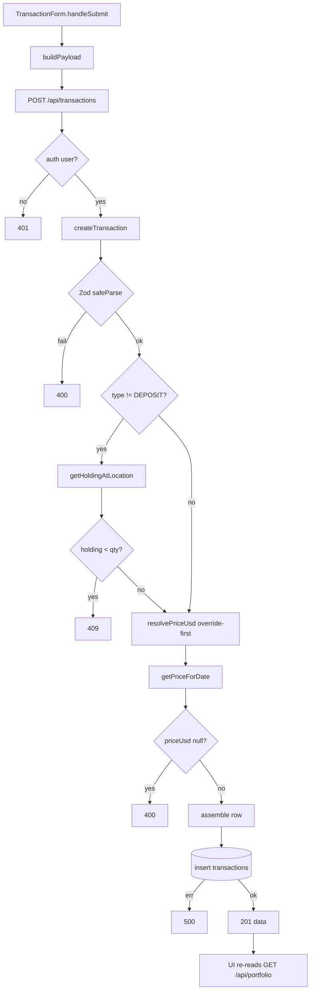

# Research: Trade write-spine — Deep Focus

**Date**: 2026-06-23
**Git Commit**: 392ed25 · **Branch**: master · **Repo**: VaultView (m1)
**Prior**: `context/map/repo-map.md` (treated as hypothesis to verify, not truth)

## Research Question

Trace the trade write-spine (`TransactionForm → /api/transactions →
transaction-service → pnl-engine`, plus `schemas`, `types`, `coinpaprika`)
end-to-end; find test gaps; map blast radius. Analysis only — no refactor.

## Summary

The spine works as a **history-replay** system: writes persist a single
`transactions` row; **all P&L (realized + unrealized) and cost basis are computed
on read** by replaying the full transaction history through `pnl-engine.ts`. There
is no cost-basis table. The map's central claims held up — `transaction-service.ts`
is the hub, the `schemas ↔ types ↔ DB` seam is the fragile spot — but Deep Focus
**sharpened two of them and reversed one**:

- **Sharpened (worse than mapped):** the contract seam isn't just "watch this" — the
  transaction shape is defined **three times by hand** (Zod, TS types, SQL) over an
  **untyped Supabase client** with an `as Transaction` cast, so a column rename
  **drifts silently with no compile error**. The insert literal is also duplicated.
- **Sharpened (better than mapped):** `pnl-engine.ts` is *exceptionally* well tested
  (all 5 type branches, the over-sell clamp, the same-minute ordering tie). The
  untested P&L math is in the **service** (`getTransactionsWithPnl`), not the engine.
- **Reversed:** the map flagged `coinpaprika.ts` as an ACL risk zone. It is actually
  the **cleanest part of the spine** — already a working anti-corruption layer
  (vendor types are function-local and unexported). Its only debt is two *latent*
  runtime guards, not structural leakage.

---

## 1. Feature overview

> What the flow does, who validates, where state changes, what comes back.

### Request path (form submit → DB → re-read)

| # | Step | Where (`file:line`) | Tag |
|---|---|---|---|
| 1 | `handleSubmit` → `buildPayload()` → `POST /api/transactions` | `TransactionForm.tsx:233-244` | evidence |
| 2 | Type-specific payload shaping | `TransactionForm.tsx:162-231` | evidence |
| 3 | POST handler: auth gate → client → parse → `createTransaction` | `api/transactions.ts:8-32` | evidence |
| 4 | Supabase SSR client (null if env missing) | `supabase.ts:5-24` | evidence |
| 5 | Zod `createTransactionSchema.safeParse` → 400 on fail | `transaction-service.ts:99-103`, `schemas.ts:9-66` | evidence |
| 6 | Balance guard (non-DEPOSIT): `getHoldingAtLocation` → 409 | `transaction-service.ts:107-115`, `:13-48` | evidence |
| 7 | `resolvePriceUsd` (override-first) → 400 if null | `transaction-service.ts:50-92,117-133` | evidence |
| 8 | Price API: `getPriceForDate` → current(TTL 120s)/historical | `coinpaprika.ts:56-162` | evidence |
| 9 | Assemble row (`isOneSided`, `price_usd`) | `transaction-service.ts:135-155` | evidence |
| 10 | Insert `.select().single()` → 500 on error; RLS `auth.uid()=user_id` | `transaction-service.ts:158-164`, `migration:41-43` | evidence |
| 11 | 201 `{data}` | `api/transactions.ts:31` | evidence |
| 12 | UI: close dialog → re-fetch `GET /api/portfolio`, reset state | `PortfolioView.tsx:121-132` | evidence |

### Key behaviors

- **Realized P&L is computed on read**, not on write: `pnl-engine.ts:86`
  `realizedPnl = source_quantity * (price_usd - avgCost)`, `avgCost =
  total_cost_usd / quantity` (`:85`). [evidence]
- **Cost basis is derived on read**: target position `total_cost_usd +=
  source_quantity * price_usd` (`pnl-engine.ts:99-101`). The only persisted
  cost-basis input is the row's `price_usd` (`transaction-service.ts:151`).
  **No cost-basis table** — recomputed each read. [evidence/inference]
- **Read-back is fresh from DB**: the 201 body is discarded by the form; the UI
  re-fetches `GET /api/portfolio` (`PortfolioView.tsx:121-132`). The 20s price
  polling only patches `current_price_usd` in memory; it does not re-read
  transactions. [evidence]
- **Price suggestion + override**: client fetches `GET /api/prices` to pre-fill
  `price` (`TransactionForm.tsx:62-111`); the field is freely editable; the server
  honors it override-first (`resolvePriceUsd` `:61` short-circuits API lookups). [evidence]

### How the 5 transaction types diverge

| Stage | DEPOSIT | BUY | SELL | SWAP | WITHDRAW |
|---|---|---|---|---|---|
| UI form path | yes | yes | yes | **no** (schema/engine only) | yes |
| Zod refine | one-sided, future-date blocked | two-sided | two-sided | two-sided | one-sided, future-date **not** blocked |
| Balance guard | **skipped** | runs | runs | runs | runs |
| Price | source @ date (stable→$1) | two-sided derive | two-sided | two-sided | source @ now |
| Engine | acquire only | dispose+acquire | dispose+acquire | dispose+acquire | dispose only |
| Realized P&L | none | yes | yes | yes | yes |

[evidence — `TransactionForm.tsx:10,215`; `schemas.ts:25-49`;
`transaction-service.ts:107,66-91,137-149`; `pnl-engine.ts:72-103`]

> Note the **SWAP asymmetry**: SWAP is fully implemented in `schemas.ts` and
> `pnl-engine.ts` but has **no UI form path** — it only falls through the SELL
> branch in `buildPayload`. [evidence] And **WITHDRAW future-date is not blocked**
> while DEPOSIT is (`schemas.ts:29`). [evidence]

> Separate sibling spine: **sell-all-global** (`/api/transactions/batch` →
> `createSellAllGlobal`, `transaction-service.ts:167-239`) — per-location validate,
> stablecoin-only targets, single atomic multi-row insert. [evidence]

---

## 2. Technical debt

> Map of fragility — not a list of ugly files. Each item tagged with a verdict so
> L4 can rank. **Cheap/healthy coupling is called out so it is not mistaken for debt.**

### D1 — Contract seam triplication over an untyped DB client  ⚠ highest

The transaction shape is defined **three times, by hand**, with nothing tying them
together at compile time:

- Zod input: `schemas.ts:9-20` · TS types: `types.ts:3-25` · DB columns:
  `migrations/...create_transactions.sql:4-32` (+ `price_usd` migration). [evidence]
- The insert object is built as an **inline literal** and cast — **3 casts total**
  (verification: report originally said 2): `as Transaction` at `:164`, `as
  Transaction[]` at `:238` and `:252` — with `eslint-disable no-unsafe-assignment`
  at `:157`. The Supabase client is **untyped** — no generated `database.types.ts`
  exists (confirmed: none found). [evidence]
- **Consequence:** a column rename/add in SQL produces **no TS error**. The
  field-name translation (`price` vs `price_usd`, `source_price_usd_override`) lives
  only in the service glue (`:135-151`) and must be threaded by hand. [evidence/inference]
- `TransactionInsert` (`types.ts:20-25`) exists *but is bypassed* — the service
  doesn't use it. [evidence]

**Verdict:** accidental complexity, business-critical (silent data drift). This is
the map's "contract seam to watch" — confirmed and **worse** than mapped.

### D2 — Duplicated insert literal

The row-assembly literal is duplicated: `transaction-service.ts:143-155` (single)
and `:209-221` (sell-all). Both must change together for any field change; neither
derives from a shared type. [evidence] **Verdict:** accidental, mechanical — pairs
naturally with D1's fix.

### D3 — Untested P&L on the service read path

- **`getTransactionsWithPnl` has zero coverage at any layer** (grep-confirmed: name
  appears only in source). It carries the per-lot unrealized-P&L formula
  (`:299-300`) and the `stale`/`updated_at` flags in the `GET /api/transactions`
  response. [evidence]
- **`createTransaction` BUY/SWAP/WITHDRAW write paths untested** — integration tests
  drive only DEPOSIT + SELL. The 5-type matrix is complete in the *engine* but not
  on the *write spine*. [evidence]
- **API route handlers have no direct tests** — 401 (no user), 500 (null client),
  400 (bad JSON), 500 (insert error) covered only by a single DEPOSIT e2e happy
  path. [evidence]
- `createTransaction` price-null→400 (`:127-133`) and insert-error→500 (`:160-162`)
  untested; the 409 holding branch IS covered (integration). [evidence]

**Verdict:** real debt against the PRD guardrail "wrong numbers are worse than no
numbers" — wrong P&L would ship behind a 200 OK.

### D4 — CoinPaprika boundary: clean structure, two latent runtime guards

- **Structurally the cleanest part of the spine** — already an ACL: vendor wire
  types (`SearchResponse`, `TickerResponse`, `HistoricalTick`) are **function-local
  and unexported** (`coinpaprika.ts:30-41,60-62,136-139`); callers only ever see
  app types (`PriceLookupResult`, `CoinSearchResult`). [evidence] A provider swap
  touches `coinpaprika.ts` internals only.
- **Two unguarded failure modes** (already in `lessons.md`, re-confirmed present):
  (1) no response-type validation — `(await res.json()) as T` with no `isFinite`
  guard (`:23`); (2) no request timeout / `AbortController` (`:19-27`). [evidence]
- **One real leak:** the CoinPaprika `coinId` convention (e.g. `usdt-tether`) flows
  via `USD_STABLECOINS` (`schemas.ts:3`) into stored `source_asset`/`target_asset`
  — a provider with different id formats would ripple into stored data. [inference]

**Verdict:** do **not** refactor the structure (guard, don't rebuild). The two
guards are an observability/runtime follow-up, not a structural change.

### D5 — SWAP / WITHDRAW asymmetries

SWAP has no UI path (engine/schema only); WITHDRAW future-date is unguarded while
DEPOSIT's is. [evidence] **Verdict:** small correctness/scope questions — domain
decisions, candidates for the L5 DDD pass, not structural refactor.

### Cheap coupling (NOT debt — do not "fix")

- `*.test.ts ↔ source` co-change (3–4×) is healthy test-with-source. [evidence]
- The `schemas ↔ service ↔ pnl-engine ↔ types` co-change is the *feature signature*
  (DEPOSIT/WITHDRAW/sell-all each rippled across the spine) — expected for a spine,
  caught by tests where they exist. [evidence]

---

## Blast radius — "if you touch X, also touch …"

| Change | Must also change (proof) |
|---|---|
| `schemas.ts` field | `transaction-service.ts` insert+resolvePriceUsd [git 4× + import]; its test [git]; `TransactionForm.tsx` body [import]; migration [inference] |
| `types.ts` `Transaction` | `transaction-service.ts` [git 2×]; `pnl-engine.ts` [import]; portfolio consumers [import]; migration [inference] |
| `transaction-service.ts` | its test [git 4×]; `schemas.ts` [git 4×]; `pnl-engine.ts` [git 3×]; `api/transactions.ts` [git 3×]; batch/holdings/locations routes [import] |
| `pnl-engine.ts` | its test [git 3×]; `transaction-service.ts` [git 3×]; `portfolio-service.ts` [import] |
| `coinpaprika.ts` signatures | service, portfolio-service, `api/prices.ts`, `api/assets/search.ts` [import]; its test [git] |
| migration (column) | types + 2 insert literals + schemas + form — **none fail to compile** (untyped client) [evidence+inference] |

---

## Confirmed priors (from `context/foundation/lessons.md`)

- **Deterministic ordering** `(transaction_date, created_at)` — **well covered**:
  `pnl-engine.test.ts:375` proves the same-minute BUY/SELL tie realizes correctly;
  `:409` documents the failure mode. Rule still holds. [evidence]
- **CoinPaprika two unguarded modes** — re-confirmed present (D4). [evidence]
- **Cost-basis vs live-mark drift** — relevant to the *untested* `getTransactionsWithPnl`
  (D3); the live-mark behavior is by design but its code path has no test. [evidence]

## Map corrections (prior refined by evidence)

1. `coinpaprika.ts` is **not** a structural risk zone — it is the cleanest part
   (working ACL). Downgrade as a refactor target. [evidence]
2. "P&L correctness" risk lives in the **service** (`getTransactionsWithPnl`), not
   the **engine** — the engine is thoroughly tested. [evidence]
3. The "contract seam to watch" is upgraded to **silent-drift risk** (untyped
   client, triplicated definitions, `as` cast). [evidence]

## Open questions (unknown — for ast-grep verification + L4)

- `/api/portfolio`, `/api/prices`, `/api/holdings`, `/api/locations` handlers not
  read — whether `/api/portfolio` calls `computePositions` is **inference**. [unknown]
- Exact count of insert-literal duplications and `as Transaction` casts — to be
  pinned by ast-grep (next step). [unknown]
- Whether the `coinId`-in-stored-data leak (D4) ever actually blocks a provider
  swap — depends on a real swap; deferred. [unknown]

## Claim verification (ast-grep)

Structural claims pinned with `ast-grep 0.44.0`; every zero/low count confirmed
with a plain `grep` (a structural matcher returns 0 for a bad pattern, not only for
a true absence).

| # | Claim | Verdict | Evidence | Method |
|---|---|---|---|---|
| 1 | `getTransactionsWithPnl` never referenced in any test (D3) | **confirmed** | 0 hits in `*.test.ts`/`e2e`/`tests`; only `transaction-service.ts:279` (def) + `api/transactions.ts:6,44` | grep across test dirs |
| 2 | `as Transaction` casts in `transaction-service.ts` (D1) | **corrected: 3 (report: 2)** | `:164` `as Transaction`; `:238`, `:252` `as Transaction[]` | ast-grep `$X as Transaction` → 1; grep `as Transaction` → 3 |
| 3 | `.from("transactions").insert(...)` call sites (D2) | **confirmed: exactly 2** | `:158` (single), `:232` (sell-all batch) | ast-grep `$C.from("transactions").insert($$$A)` + grep `.insert(` |
| 4 | Files importing `coinpaprika` (D4 boundary) | **confirmed: 4, none in UI** | `transaction-service.ts`, `portfolio-service.ts`, `api/prices.ts`, `api/assets/search.ts` | grep `lib/coinpaprika` |

**What verification changed:** one undercount fixed — the cast count was 2, is 3
(the agent's matcher missed the two `as Transaction[]` array casts; `grep` caught
them). The `as Transaction[]` vs `as Transaction` split is the precision/recall
trade-off in miniature: the AST matcher is exact, `grep` is honest. Claim 4's
"none in UI" finding *strengthens* the D4 verdict — coinpaprika is imported only in
the service/API layers, never in a component. No ranking or verdict was overturned.
