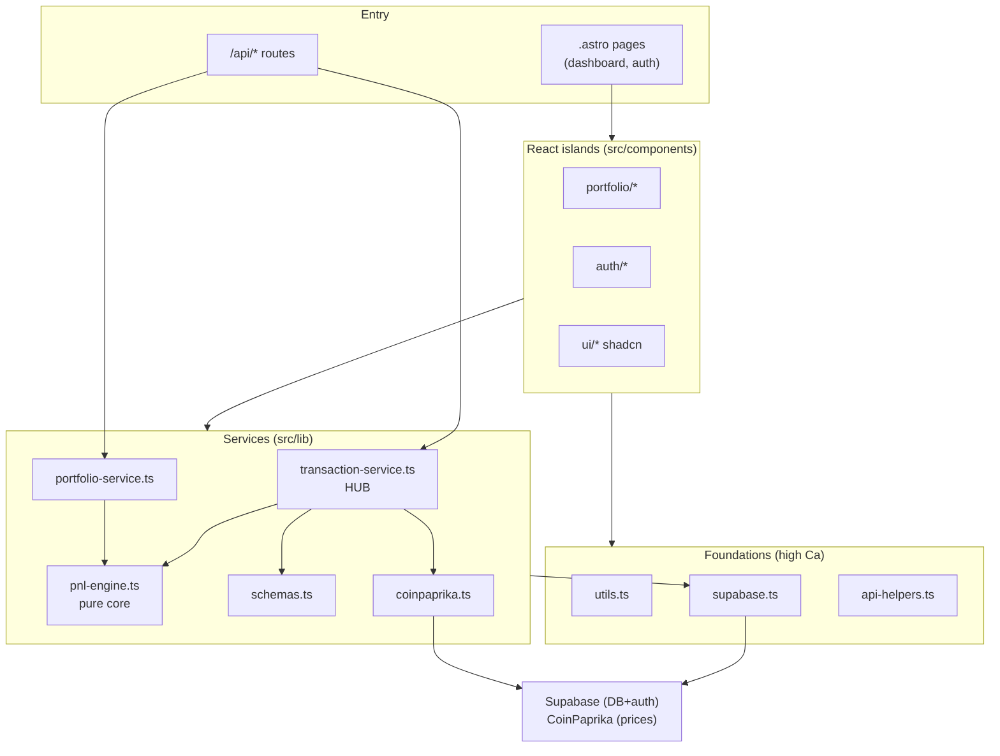

# VaultView — Project Map

> Onboarding map for an agent or developer entering this repo. Decision-oriented,
> evidence-backed. Read in ~10 min and know where things live, what's risky, and
> where to start. This is signal synthesis, not a full description.

## 1. TL;DR

VaultView is an **Astro 6 SSR crypto-portfolio tracker** (React 19 islands,
Tailwind 4, Supabase auth + DB, CoinPaprika pricing, deployed to Cloudflare
Workers). The product's gravity is the **trade write-spine**: `TransactionForm →
/api/transactions → transaction-service → pnl-engine`, with `transaction-service.ts`
the architectural hub (depended on by 5 modules, depends on 3) and the most-edited
code file. P&L math lives in a **pure, dependency-free core** (`pnl-engine.ts`,
instability 0%) that is easy to test and refactor in isolation. The import graph
is **clean — no cycles** across 54 modules. A second, low-coupling corridor handles
**auth** (middleware + Supabase + auth pages). The repo is **solo-authored**, so the
real "who knows this" is `context/` (archived changes act as ADRs).

## 2. Territory — where work concentrates

- **Deep / high-responsibility:** `src/lib` (55 dir-changes) and
  `src/components/portfolio` (32). The trade + P&L + portfolio logic.
- **Hottest code files:** `transaction-service.ts` (11), `TransactionForm.tsx` (11),
  `PortfolioTable.tsx` (6), `pnl-engine.ts` (5), `dashboard.astro` (5), `schemas.ts` (5).
- **Periphery / shallow:** `src/components/ui` (shadcn primitives), auth pages —
  touched in bursts, then stable.
- **Activity-over-time caveat:** only ~2 weeks of history, so "active vs frozen"
  is weak; read the ranking as "where build effort concentrated," not lifecycle.

## 3. Real connections — what actually moves together

- **Contract seam (git co-change 5×):** `schemas.ts ⟷ transaction-service.ts` —
  the Zod contract drives the service; `types.ts` is the third corner.
- **The spine (graph + co-change):** `transaction-service → coinpaprika + pnl-engine
  + schemas`; reached from `/api/transactions.ts` and `TransactionForm.tsx`.
- **UI pair:** `PortfolioTable ⟷ PortfolioView` render together.
- **Auth cluster:** signin/signup/confirm/dashboard + `/api/auth/*` — self-contained,
  low coupling to the trade core.
- **Cycles:** none.
- **Coupling provenance:** foundations `utils.ts` (Ca 16), `supabase.ts` (Ca 9),
  `api-helpers.ts` (Ca 7) — wide blast radius from the import graph (not git churn).

## 4. Risk zones (high blast radius / business-critical)

| Zone | Why it's risky |
| --- | --- |
| **Trade write-spine** (`transaction-service.ts` + `/api/transactions` + form) | Hub: change radiates to validation, transport, calc. Center of gravity. |
| **P&L correctness** (`pnl-engine.ts`) | PRD guardrail: math must be arithmetically verifiable. Pure core — bugs are silent, not crashes. |
| **Contract seam** (`schemas.ts` ↔ `transaction-service.ts` ↔ `types.ts`) | Co-change 5×; drift between Zod schema, service, and shared types corrupts data quietly. |
| **Foundations** (`utils.ts`, `supabase.ts`, `api-helpers.ts`) | Highest Ca; a change here touches most of the app. |
| **External boundary** (`coinpaprika.ts`) | Network dep + free-tier rate limits (tech-stack.md); leak of its shape into domain is the classic ACL risk (see L5). |
| **Data isolation** (`middleware.ts` + Supabase RLS) | PRD guardrail: no cross-user data. Auth corridor + RLS policies must hold. |

## 5. Who to ask
Solo repo → **you**. Authoritative "why" lives in `context/archive/` (closed
changes with plans + research) — consult those before touching a risk zone, esp.
`testing-pnl-trade-math` and `testing-persistence-data-isolation`.

## 6. First day — read these 5–8 files, in order

1. `src/lib/transaction-service.ts` — the hub; start here
2. `src/lib/pnl-engine.ts` — the average-cost calculation
3. `src/lib/schemas.ts` — the validation contract
4. `src/types.ts` — shared domain types
5. `src/pages/api/transactions.ts` — HTTP entry to the spine
6. `src/components/portfolio/TransactionForm.tsx` — the write UI
7. `src/middleware.ts` — auth gate / route protection
8. `src/lib/supabase.ts` — DB client + null-when-unconfigured pattern

## 7. Limitations
- **Window:** entire 2-week repo life; no long-term active/frozen signal.
- **Method:** static import graph + git history. `.astro` pages are **not** parsed
  by dependency-cruiser → page→lib imports are real but unmeasured (`unknown`).
- **Not captured:** runtime wiring (island hydration, middleware injection, RLS
  enforced in DB), and anything that *should* co-change but historically hasn't.
- **Contributors:** degenerate (solo) — see artifact 3.
